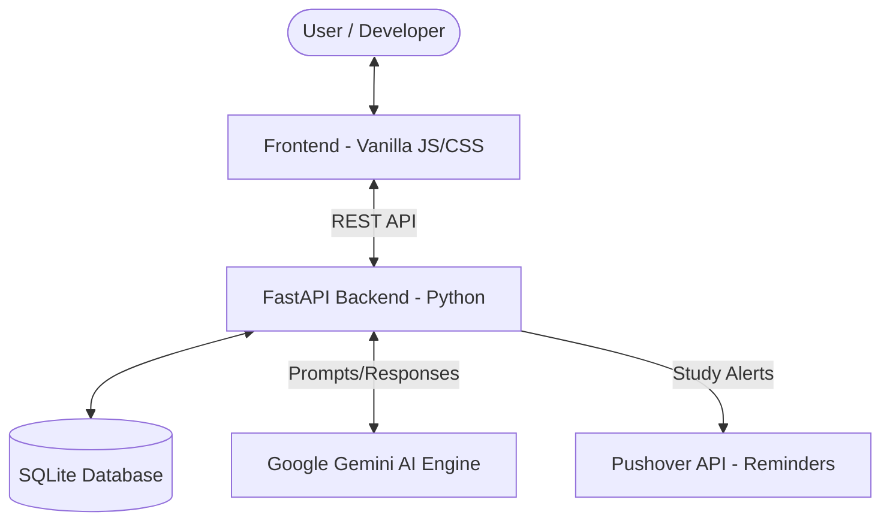

# DevMentor AI 🚀

[](https://fastapi.tiangolo.com/)
[](https://developer.mozilla.org/en-US/docs/Web/JavaScript)
[](https://deepmind.google/technologies/gemini/)
[](https://sqlite.org/)
[](https://opensource.org/licenses/MIT)

DevMentor AI is a **state-of-the-art, AI-powered learning platform** designed to provide a personalized, adaptive, and interactive educational experience. It goes beyond static courses by dynamically generating roadmaps, testing knowledge with scenario-based quizzes, and providing a 24/7 AI mentor.

---

## 🌟 Why DevMentor?

Traditional learning paths are often rigid and don't account for individual struggles. **DevMentor AI** bridges this gap by:
1.  **Thinking with you**: It identifies where you are struggling and *adapts* your roadmap automatically.
2.  **Scenario-driven**: Quizzes focus on *real-world application* rather than just theory.
3.  **Always Available**: A dedicated AI Dev Studio for deep-dives and debugging.

---

## 🏗️ System Architecture



---

## ✨ Key Features

- **🎯 Personalized Roadmaps**: Generate multi-day learning paths tailored to your career goals.
- **🧠 Adaptive Intelligence**: Real-time identification of "Weak Topics" with suggested roadmap adjustments.
- **📝 Logic-Based Quizzes**: Every task completed triggers an AI-generated quiz focused on practical scenarios.
- **💬 Dev Studio AI Assistant**: Conversational workspace for deep-diving into complex topics and debugging.
- **⏰ Smart Study Notifications**: Integrated **Pushover** alerts to keep you on schedule.
- **📊 Interactive Dashboard**: Visualize progress, completion status, and AI insights.
- **🔐 Secure Authentication**: Full user management system to persist your progress across sessions.

---

## 🛠️ Tech Stack

### Frontend & UI
- **Modern Web**: Vanilla JS (ES6+), HTML5, and CSS3.
- **Styling**: Glassmorphism, custom CSS variables, and responsive grid layouts.

### Backend & AI
- **Framework**: FastAPI (Python) for high-performance asynchronous logic.
- **ORM**: SQLAlchemy with SQLite for reliable data persistence.
- **AI Engine**: Google Gemini Pro for roadmap generation and mentor reasoning.

### Deployment & DevOps
- **Vercel**: Unified deployment for both static frontend and serverless backend functions.
- **Pushover API**: External notification service for study reminders.

---

## 🚀 Getting Started

### 1. Project Initialization
```bash
# Clone the repository
git clone https://github.com/devsoni0419/DevMentor-AI.git
cd DevMentor-AI

# Setup Python Virtual Environment
python -m venv venv
source venv/bin/activate  # Windows: venv\Scripts\activate

# Install dependencies
pip install -r requirements.txt
```

### 2. Configuration (`.env`)
Create a `.env` file in the root directory with your credentials:
```env
DATABASE_URL=sqlite:///./devmentor.db
GEMINI_API_KEY=your_google_gemini_key_here
PUSHOVER_USER_KEY=your_pushover_user_key (optional)
PUSHOVER_API_TOKEN=your_pushover_app_token (optional)
```

### 3. Launch the Services
- **Backend**: `uvicorn backend.main:app --reload`
- **Frontend**: Serve `frontend/index.html` via any local server (e.g., Live Server).

---

## 📈 Roadmap

### ✅ Completed
- [x] **AI Roadmap Engine**: Dynamic generation of learning paths using Google Gemini.
- [x] **Adaptive Quiz Logic**: Scenario-based testing for practical knowledge validation.
- [x] **Dev Studio Assistant**: Context-aware AI mentor for deep doubt resolution.
- [x] **Automated Reminders**: Background task for scheduled study notifications via Pushover.
- [x] **Intelligence Dashboard**: Progress tracking with identification of "Weak Topics".
- [x] **Secure Auth**: Full user management and data persistence.
- [x] **Responsive Core**: Modern, high-performance UI tailored for both desktop and tablet.

### 🚀 Future Improvements
- [ ] **Achievement System**: Gamified badges and points for streak preservation.
- [ ] **Multi-Channel Notifications**: Integration with Telegram, Discord, and Email alerts.
- [ ] **Community Groups**: Peer-to-peer learning spaces and roadmap sharing.
- [ ] **Code Playground**: Integrated sandbox for practicing coding tasks without leaving the app.
- [ ] **PWA Support**: Full offline capabilities and mobile-app-like installation.
- [ ] **Roadmap Export**: Export your learning path as PDF or Markdown.

---

## 📄 License
This project is licensed under the MIT License - see the [LICENSE](LICENSE) file for details.

*Built with ❤️ by [Dev Soni](https://github.com/devsoni0419)*
